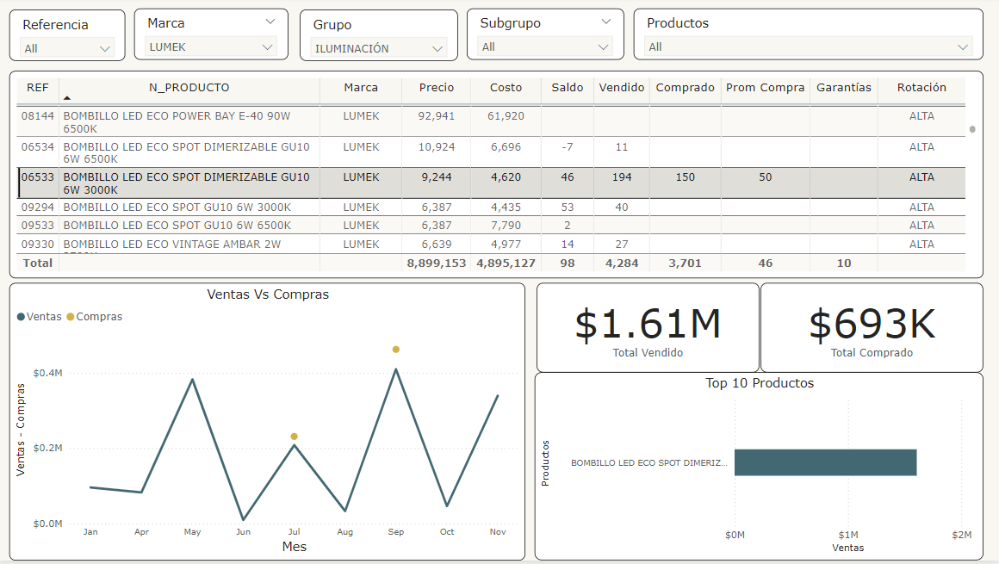
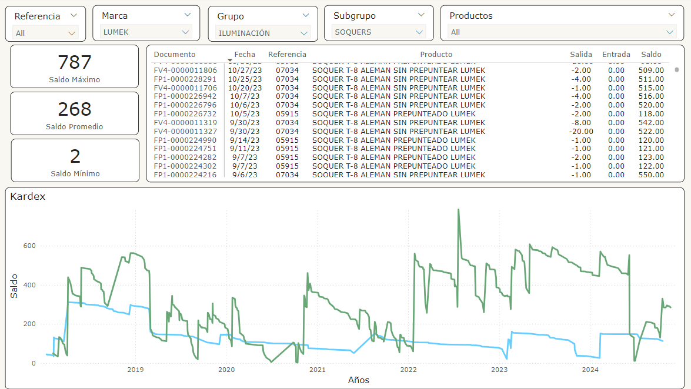

# Creación del kardex visual

## Caso de estudio 

El software contable brinda la oportunidad de ver los movimientos de los productos por medio de kardex, pero este se limita a información tabulada, por lo que se desea tener el reporte por medio de gráficas. También, se desean crear dashboards que permitan tener el control del inventario y tomar decisiones para procesos como la compra de productos.

## Propuesta
Para este caso, se tomarán los datos relacionados con el movimiento de inventario, como lo son ventas, compras, transferencia entre bodegas, notas de inventario, entre otros. 

Luego, usaremos Power BI para la creación de reportes y dashboards que permitan ver gráficamente el movimiento de los productos y permitan tomar decisiones basadas en datos. 

## Proceso
Se extajo la información de PostgreSQL por medio de querys. Se modificaron todos los data sets para que coincidieran en la cantidad de columnas y poder concatenarlas. 

Luego, se crearon las columnas de entrada y salida de inventario con el fin de obtener un resumen del saldo que el producto tiene a traves del tiempo. 

Al final, se exportó este dataframe llamado "kardex" a PostgreSQL y se conectó la base de datos a Power BI, permitiéndonos crear informes y dashboards. 

## Aprendizaje y Conclusión

- Uso de recursos disponibles para la creación de nuevos productos. 

- Enlazar Python, PostgreSQL y Power BI. 

- Creación de reportes y dashboards.

## 🔗 Links

## Screenshots
### Dashboard Pedidos:

### Visualización del Kardex

